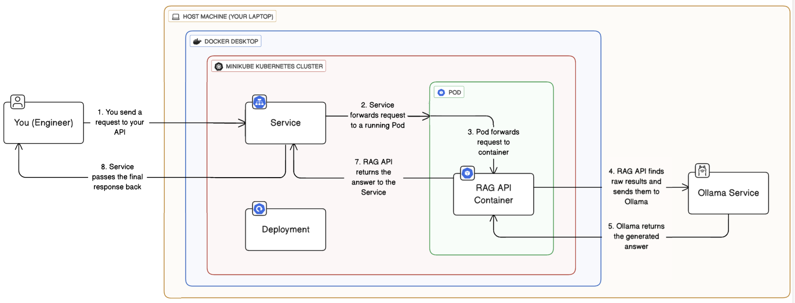
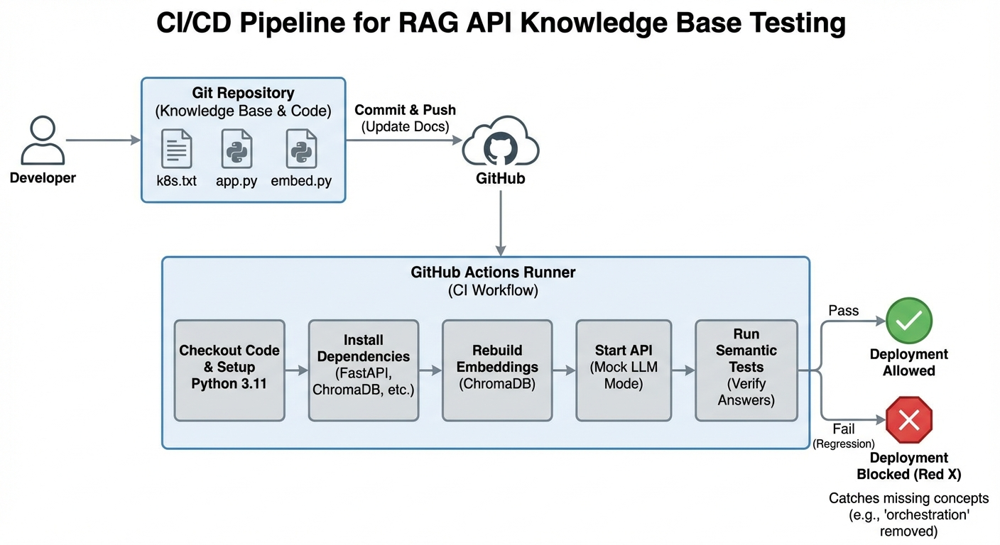

# RAG API Knowledge Base (FastAPI + ChromaDB + Ollama)

Build a minimal, testable RAG API that answers questions from a local knowledge base using ChromaDB retrieval and an Ollama model.



---

## Why this project
- Simple RAG loop: embed -> retrieve -> answer
- FastAPI endpoint with local, persistent ChromaDB storage
- Mock LLM mode for CI to validate semantic quality
- Docker and Kubernetes manifests included

---

## Architecture at a glance
Request flow: FastAPI service -> ChromaDB retrieval -> Ollama generation -> response.



---

## Quickstart

### 1) Local run
```bash
python -m venv .venv
.\.venv\Scripts\Activate.ps1
pip install -r requirements.txt
copy docs\k8s.txt k8s.txt
python embed.py
uvicorn app:app --host 0.0.0.0 --port 8000
```

### 2) Query the API
```bash
curl -X POST "http://127.0.0.1:8000/query?q=What%20is%20Kubernetes?"
```

### 3) Docker
```bash
docker build -t rag-app .
docker run -p 8000:8000 rag-app
```

### 4) Kubernetes (minikube)
```bash
kubectl apply -f deployment.yaml
kubectl apply -f service.yaml
```

---

## API

### POST /query
- Query string: `q`
- Returns: `{ "answer": "<model response>" }`

Example:
```bash
curl -X POST "http://127.0.0.1:8000/query?q=What%20is%20Kubernetes?"
```

---

## Configuration
- `USE_MOCK_LLM=1` returns the retrieved context directly (CI mode)
- `OLLAMA_HOST` points the API to an Ollama server (see `deployment.yaml`)

---

## CI pipeline
GitHub Actions rebuilds embeddings, starts the API in mock mode, and runs semantic checks.

---

## Project structure
```text
.
|- app.py              FastAPI RAG endpoint
|- embed.py            Embeds `k8s.txt` into ChromaDB
|- docs/k8s.txt        Sample knowledge base content
|- semantic_test.py    Semantic regression tests
|- deployment.yaml     Kubernetes deployment
|- service.yaml        Kubernetes service
|- Dockerfile          Container build
`- .github/workflows   CI pipeline
```

---

## Notes
- The embed script expects `k8s.txt` in the repo root. A sample lives at `docs/k8s.txt`.
- Diagrams live in `assests/` and are embedded above.
